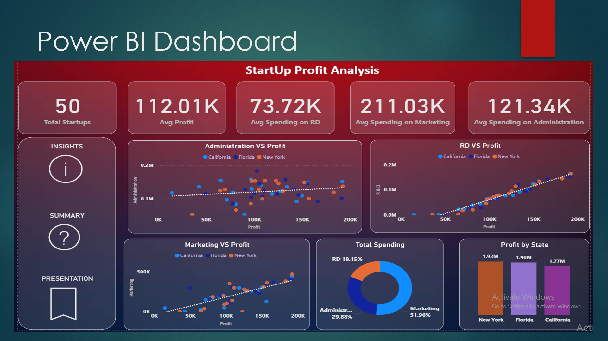
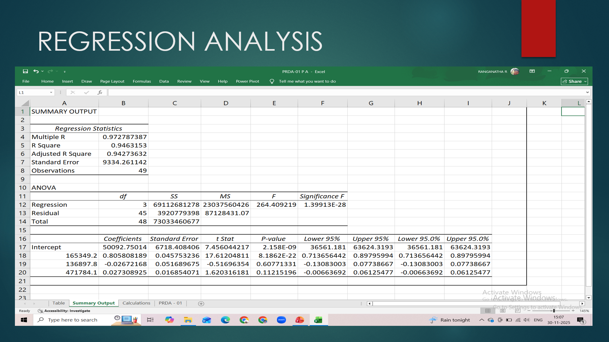

# Startup Profitability & Regression Analysis

## 📌 Project Overview
This project analyzes the spending patterns of 50 startups to determine how different types of expenditure (R&D, Administration, and Marketing) impact their final profit. Using Regression Analysis, I built a predictive model to estimate profit based on various spending scenarios.

## 🛠️ Tools Used
* **Data Extraction:** SQL (MySQL)
* **Statistical Analysis:** MS Excel (Analysis ToolPak)
* **Visualization:** Power BI
* **Documentation:** MS Word / PowerPoint

## ⚙️ Work Flow

### 1. Data Extraction & Integrity Check
* **SQL Exploration:** Connected to `project_profit_analysis` and performed data validation on the startup dataset. 
* **Null Value Audit:** Verified all 50 records for completeness using SQL queries; confirmed zero null values.
* **Format Optimization:** Exported data to CSV and utilized Power Query to ensure data types were correctly assigned for analysis.

### 2. Statistical Modeling (Regression Analysis)
* **Impact Assessment:** Performed a Multiple Linear Regression in Excel to identify the relationship between spending factors and profit.
* **Coefficient Analysis:** Identified key intercepts and coefficients, noting that one specific spending factor showed a negative correlation with profit.
* **Prediction Engine:** Applied the Regression formula to calculate predicted profits for specific business scenarios provided in the problem statement.

### 3. Power BI Dashboard Development
* **Data Persistence:** Resolved file corruption issues by migrating data from CSV to `.xlsx` to ensure stable imports.
* **KPI Design:** Developed custom measures and KPIs to track spending efficiency.
* **Visual Storytelling:** Built a multi-visual dashboard featuring scatter plots for regression visualization, doughnut charts for spending distribution, and bar charts for state-wise performance.
* **Advanced Insights:** Created calculated columns and supporting visuals to validate "Observations vs. Recommendations."

## 📊 Key Insights
* **[Profit generally increases with higher spending]**
* **[Marketing has the strongest impact on profit growth. R&D gives steady returns; Admin impact is inconsistent.]**
* **[Average profit is 112K$, indicating early stage but healhty starteups]**

## 💡 Recommendations
* **[Increase Marketing investment to boost profit.]**
* **[Maintain R&D spending for consistent growth.]**
* **[Optimize Admin costs for efficiency.]**

## 📁 Files in Repository
* **Analysis Folder:** Excel sheets with Regression formulas and output.
* **Detailed Work flow:** Steps followed during project.
* **Power BI File (.pbix):** Interactive profitability dashboard.

  ## 🖥️ Dashboard & Analysis Preview

